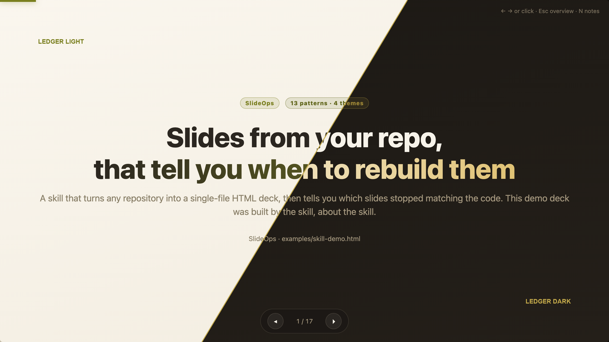
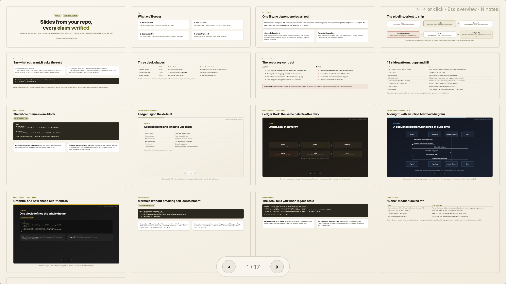
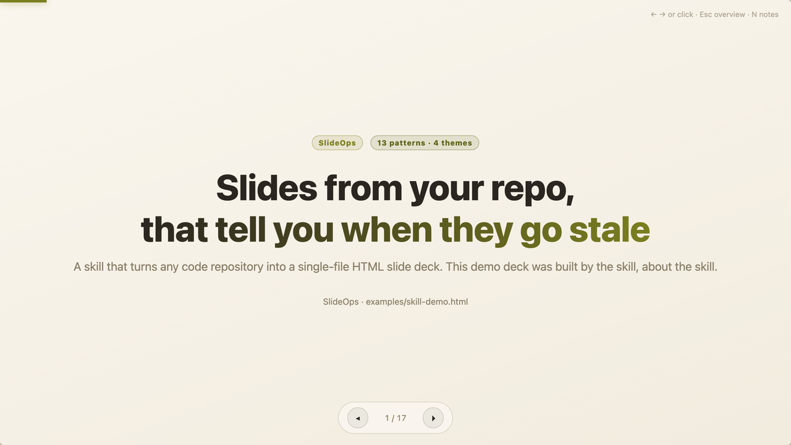
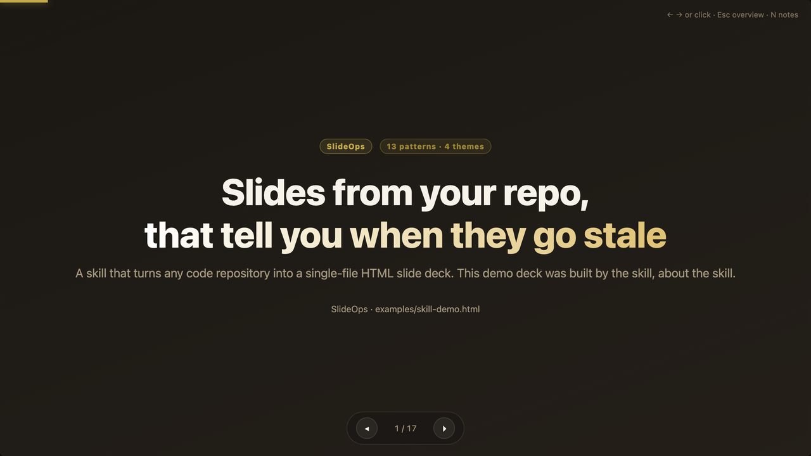

<div align="center">

<h2>Generate a deck from your code in minutes. Find out in milliseconds when it stops being true. Then rebuild only the slides that drifted.</h2>

[](https://github.com/glukicov/slideops/actions/workflows/ci.yml)
[](https://github.com/glukicov/slideops/releases)
[](LICENSE)
[](pyproject.toml)
[](.github/workflows/ci.yml)
[](https://agentskills.io/specification)
[](https://skills.sh/glukicov/slideops)

**[Install](#install) · [Use](#use) · [Features](#features) · [Docs](#documentation) · [Demo deck](https://github.com/glukicov/slideops/releases/latest/download/skill-demo.pdf) · [Why](https://medium.com/@lukicov/your-documentation-is-a-build-artifact-start-treating-it-like-one-ab48df61b1e0)**

</div>



<p align="center"><i>The demo deck is 17 slides about SlideOps, built by SlideOps: open the
<a href="skills/slideops/examples/skill-demo.html">HTML</a> or the
<a href="https://github.com/glukicov/slideops/releases/latest/download/skill-demo.pdf">PDF</a>.</i></p>

Writing documentation isn't the bottleneck any more. Keeping it true is. The deck that said
we run two database migrations still says two, a year after we started running ten 😅.

SlideOps is a pair of [Agent Skills](https://agentskills.io/specification) for Claude Code
and compatible coding agents. It treats a generated document the way you'd treat generated
code: it's built from a source, and it records which source it came from.

The reasoning behind it is written up in
**[Your documentation is a build artifact. Start treating it like one](https://medium.com/@lukicov/your-documentation-is-a-build-artifact-start-treating-it-like-one-ab48df61b1e0)**.



<p align="center"><i>Press Esc in any deck for the overview grid.</i></p>

## Install

**Claude Code.** This repo is its own marketplace, so two lines are the whole setup, and
it's the only install that keeps itself up to date:

```
/plugin marketplace add glukicov/slideops
/plugin install slideops@slideops
```

**Any agent with the [skills CLI](https://skills.sh)**, in one line:

```bash
npx skills add glukicov/slideops
```

**Codex, Copilot CLI, OpenCode**, or a plain checkout:

```bash
git clone https://github.com/glukicov/slideops && cd slideops
./install.sh
```

All four agents read `SKILL.md` and nothing needs porting between them. For the symlink and
snapshot installs, the per-agent table and how updates reach you, see
**[docs/install.md](docs/install.md)**.

> [!NOTE]
> Third-party marketplaces have **auto-update off by default**. Turn it on once in
> `/plugin` → **Marketplaces**, or new versions only arrive when you run
> `/plugin marketplace update slideops` by hand.

## Use

Open a repository and say:

> [!TIP]
> ### 💬 make slides about this repo

SlideOps scans the repo first, then asks one compact set of questions: which topic (it
proposes concrete candidates it found, each with a "why now"), audience, length, theme and
extras. You get an outline to approve before it writes any HTML.

If you already know what you want, skip the intake:

> [!NOTE]
> ### 💬 deep dive on the auth subsystem, Ledger Dark theme, 15 slides, with a PDF

Prefer a document to a deck? Since v1.1.0 the same mechanism writes Markdown:

> [!TIP]
> ### 💬 write markdown docs for the sync subsystem

You get a single `.md` that renders on GitHub, with every quoted snippet carrying an
invisible citation comment (`<!-- slideops data-src="app/main.py:40-58"
data-sha256="a1b2c3d4e5f6" -->`) above its fence, Mermaid diagrams as native fences, and
the build commit stamped on line 1. The same `check.py` sweep verifies docs and decks
together, and the same `--json` repair brief lets an agent regenerate only the sections
that drifted. PDF export mirrors the deck path with a verified, print-paginated export.

Months later, in the same repository:

> [!IMPORTANT]
> ### 💬 is the architecture deck still accurate?

The agent sweeps the deck folder and triages by status. It re-quotes whatever merely moved,
and flags the slides whose *claim* might no longer hold. It repairs what drifted instead of
regenerating the deck, so the pacing and narrative you signed off on the first time survive.

## Features

- **Freshness checking.** `scripts/check.py` sweeps a whole `docs/slides/` folder and
  reports which slides cite code that has changed, moved or vanished since the deck was
  built, then suggests the fix or hands an agent a JSON repair brief. No model, no network,
  no tokens: standard library Python, and it runs in milliseconds.
- **Markdown docs with the same guarantee.** The `.md` carrier uses HTML comments instead
  of attributes, headings instead of slide numbers, and shares every status, the sweep,
  and the repair brief with decks. The worked example is
  [`skill-demo.md`](skills/slideops/examples/skill-demo.md), checked by this repo's CI.
- **One self-contained file per deck.** No build step, no CDN, works offline, attaches to
  an email.
- **Navigation:** arrow keys, click-to-advance, URL hash deep links, an Esc-toggled
  overview grid, and speaker notes on `N` (never visible in screenshots or exports).
- **13 slide patterns:** title, agenda, section divider, prose + cards, reference table,
  before/after code, annotated snippet (half and full width), flow diagram, lane
  comparison, image + caption, chat bubbles, closing.
- **4 themes, one block each.** Every color derives from a single `:root` token block via
  `color-mix()`, so switching theme is one replacement: **Ledger Light** (default),
  **Ledger Dark**, **Midnight**, **Graphite**. Or point it at a brand's real CSS values and
  map those onto the token roles.

  | Ledger Light (default) | Ledger Dark |
  |:---:|:---:|
  |  |  |
  | *Same deck, same markup, same content.* | *One `:root` block apart.* |

- **Mermaid diagrams** pre-rendered to inline SVG at build time and themed from the deck's
  own tokens, so the deck stays dependency-free.
- **Verified PDF export.** The companion skill renders the finished PDF back to images and
  checks the pages, because a PDF can have the right page count and still hand you blank
  images.

## Documentation

| Page | What's in it |
|---|---|
| 📦&nbsp;**[Install](docs/install.md)** | Every install path, all four agents, updating, requirements, what gets installed |
| 🔎&nbsp;**[Freshness](docs/freshness.md)** | Citations, the status table, the cost model, where to automate, the accuracy contract, what never reaches a slide |
| 🛠️&nbsp;**[Development](docs/development.md)** | Working on this repository: the gate, CI guards, generated artifacts, releasing |
| 📋&nbsp;**[Changelog](CHANGELOG.md)** | What changed in each release |

Inside the skill, `skills/slideops/references/` holds the specifications the agent reads:
freshness, automation, style, themes, diagrams and verification.

## Credits

Prior art worth knowing: [frontend-slides](https://github.com/zarazhangrui/frontend-slides)
for visual-first theme selection, and
[presentation-skills](https://github.com/ktundwal/presentation-skills) for pioneering the
render-then-look visual QA loop that SlideOps also relies on. What SlideOps adds is the
*Ops* half: content grounded in a repository, and a cheap way to ask later whether it still
holds.

## Licence

MIT. See [LICENSE](LICENSE). Use it, fork it, ship it commercially; attribution is the only
condition. The decks you generate are your own content either way.

<div align="center">
<br>

**[Install](#install) · [Docs](docs/install.md) · [Changelog](CHANGELOG.md) · [Releases](https://github.com/glukicov/slideops/releases)**

<sub>Built with SlideOps, about SlideOps. If a slide in this repo ever stops matching the code, <code>check.py</code> says so.</sub>

</div>
