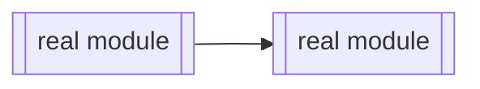

<!-- Copy this file to the output path, keep the section shapes you need, delete the
     rest, and replace every [BRACKETED] placeholder with real, verified content.
     Every fenced snippet quoted from the repository gets a slideops comment directly
     above its fence; print it with:  python3 scripts/cite.py path:start-end --repo . --md
     Stamp the finished doc (writes line 1):  python3 scripts/cite.py --stamp doc.md --repo .
     Full contract: references/markdown.md -->

# [DOC TITLE]

[One-paragraph summary: what this document covers and who it is for. Real claims only,
each traceable to the repository.]

## [Section name]

[Prose grounded in the code. Cite anything quoted or asserted from one specific place;
prose summarising a whole subsystem needs no citation.]

<!-- PATTERN: cited snippet. The comment comes from cite.py --md, never typed by hand. -->
<!-- slideops data-src="[path/to/file.py:START-END]" data-sha256="[FROM cite.py]" -->
```python
[verbatim source lines, unescaped, exactly as cite.py --md --snippet prints them]
```

<!-- PATTERN: diagram. GitHub renders mermaid fences natively; no download needed.
     Trace the real call path before drawing it; a plausible wrong diagram is worse
     than a smaller true one. -->


<!-- PATTERN: image. Real artifacts only (a chart the repo's tooling produced, a real
     screenshot); repo-relative path from the doc's location; never fabricate. -->


<!-- PATTERN: table. Build rows from a real source file and cite it when the numbers
     come from one place. -->
| [Column] | [Column] |
|---|---|
| [real value] | [real value] |

## [Next section name]

[Repeat the patterns above as needed. One idea per section; headings are what the
freshness report names when a citation drifts, so keep them specific.]
