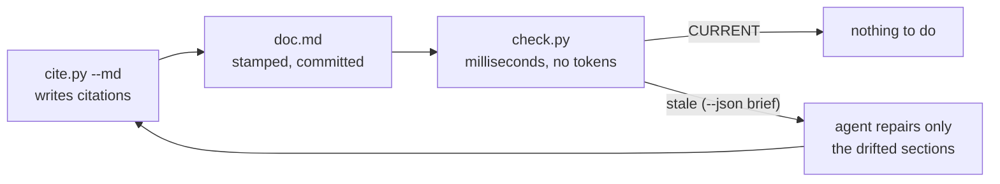

<!-- slideops-build commit=9dcc206 date=2026-08-31 repo=slideops -->
# SlideOps Markdown docs, demonstrated

This document is the worked example for the skill's Markdown mode: a doc about the
mechanism, built by the mechanism. Every fenced snippet below carries a citation comment
written by `cite.py --md`, the file carries a build stamp on line 1, and this
repository's CI runs `check.py` against this very file. If an edit to the shipped
scripts drifts a snippet, the build says so. The deck twin of this example is
[`skill-demo.html`](skill-demo.html).


## The carrier format

A doc carries the same two facts a deck carries, as comments that GitHub never renders.
The stamp owns line 1 of the file, and each citation sits directly above the fence it
vouches for:

````markdown
<!-- slideops-build commit=a8bde99 date=2026-08-31 repo=my-service -->

<!-- slideops data-src="app/main.py:40-58" data-sha256="a1b2c3d4e5f6" -->
```python
def main() -> int:
    return 0
```
````

## How the checker reads a doc

One regular expression finds the citation comments. It is deliberately narrow: a
`slideops` comment with a `data-src`, an optional lowercase hex `data-sha256`, nothing
else:

<!-- slideops data-src="skills/slideops/scripts/check.py:49-52" data-sha256="31c21278b704" -->
```python
MD_CITATION_RE = re.compile(
    r'<!--\s*slideops\s+data-src="(?P<src>[^"]+)"(?:\s+data-sha256="(?P<sha>[0-9a-f]{6,64})")?\s*-->',
    re.I,
)
```

Fenced content is masked before scanning, which is why the quoted example in the
previous section is not miscounted as a real citation, and each surviving match is
attributed to the nearest preceding heading. That heading is what a freshness report
names when the snippet drifts:

<!-- slideops data-src="skills/slideops/scripts/check.py:213-219" data-sha256="16901bd2c8c9" -->
```python
def find_citations_md(doc_text: str) -> list[Citation]:
    """Attach each citation comment to the nearest preceding Markdown heading."""
    masked = mask_fences(doc_text)
    headings: list[tuple[int, int, str]] = [
        (m.start(), index, m.group("text").strip()) for index, m in enumerate(MD_HEADING_RE.finditer(masked))
    ]
    return [_citation(match, headings) for match in MD_CITATION_RE.finditer(masked)]
```

## How the writer builds a doc

`cite.py --md --snippet` prints the comment and the source in a language-tagged fence.
Markdown needs no HTML escaping, but a snippet can contain backtick fences of its own,
so the fence grows until it cannot collide:

<!-- slideops data-src="skills/slideops/scripts/cite.py:80-83" data-sha256="8bca63483abd" -->
```python
def fence_for(lines: list[str]) -> str:
    """A backtick fence one longer than any backtick run in the content, minimum three."""
    longest_run = max((len(m) for line in lines for m in re.findall(r"`+", line)), default=0)
    return "`" * max(3, longest_run + 1)
```

Stamping is position-based rather than search-based: line 1 belongs to the stamp, so a
stamp-shaped example inside a fence (like the one in this document) is never rewritten:

<!-- slideops data-src="skills/slideops/scripts/cite.py:149-159" data-sha256="87cb2a112b78" -->
```python
    if deck.suffix.lower() in MD_SUFFIXES:
        # The stamp owns line 1 of a Markdown doc; a stamp-shaped example deeper in the
        # file (say, inside a code fence) is content and must never be rewritten.
        meta = f"<!-- slideops-build {payload} -->"
        if MD_BUILD_META_RE.match(text):
            text, action = MD_BUILD_META_RE.sub(meta + "\n", text, count=1), "updated"
        else:
            text, action = meta + "\n" + text, "inserted"
        deck.write_text(text)
        print(f"{action}: {meta}")
        return 0
```

## The loop this enables



The statuses are the same five a deck gets, and a directory sweep picks up `.md` docs
and `.html` decks together:

| Status | Meaning for a doc |
|---|---|
| `CURRENT` | the cited lines are byte-identical to the source |
| `MOVED` | same content, new line numbers; update the comment, leave the prose |
| `CHANGED` | the cited lines differ; the section's claim needs a decision |
| `MISSING` | the file is gone; the section is probably obsolete |
| `UNVERIFIED` | no hash recorded; re-cite with `cite.py --md` |

## Try it on this file

From the repository root:

```bash
python3 skills/slideops/scripts/check.py skills/slideops/examples/skill-demo.md --repo .
```

Every citation reports CURRENT, or this repository's CI would have failed the commit
that broke it.
